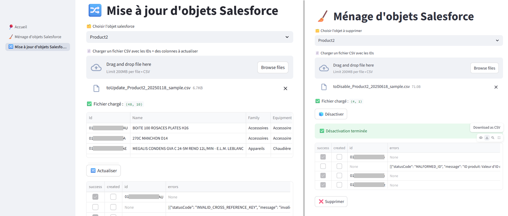

# Salesforce & helper python

## Helper python

La classe `SalesforceHelper.py` permet de centraliser qq fonctions permetant de simplifier l'utilisation de la librairie simple_salesforce pour interagir avec notre CRM SalesForce

Fonctions principales :
- se connecter à Salesforce via compte de service (oath2 à venir)
- lister les tables & colonnes salesforce (très pratique côté DataGovernance car contient les descriptions & clés de jointure)
- 2 fonctions pour récupérer les données (une simple et une via bulk2)
- Fonction d'update des données

## qq scripts CRUD python

Présence de qq scripts python pour fetch/update/delete des éléments salesforce

## Streamlit

Ajout d'une interface Streamlit POC pour réaliser les update & delete/annulation des objets salesforce Product2 & PricebookEntry

